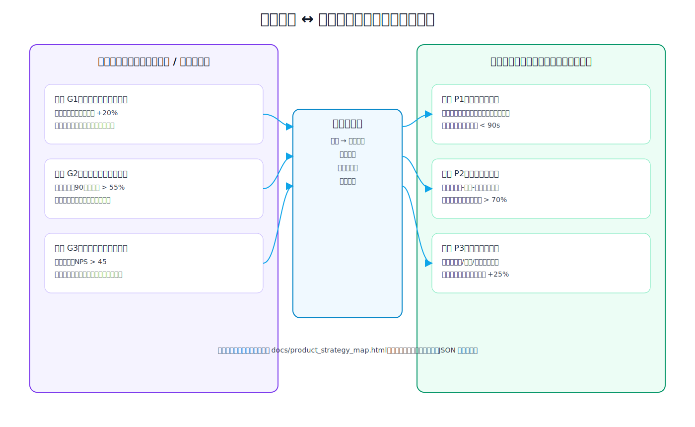
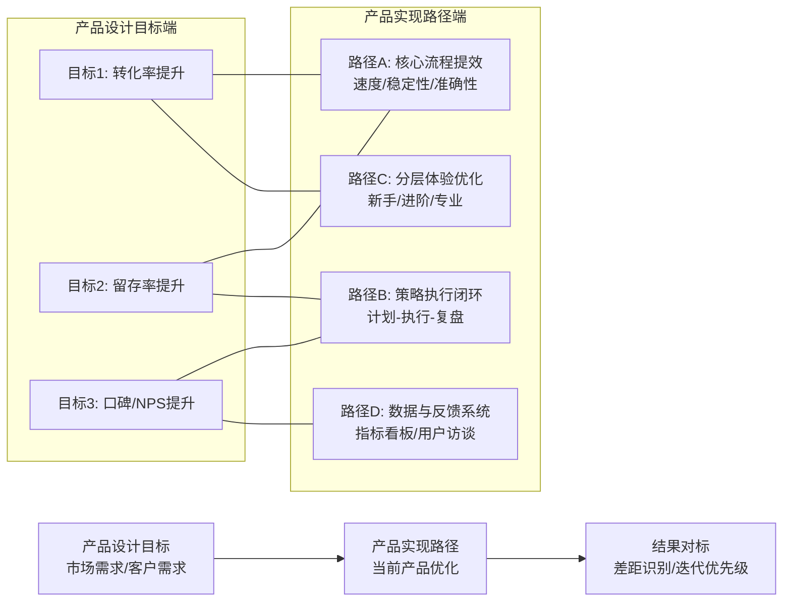

# 产品目标 ↔ 实现路径 对标图（可预览版）

> 说明：你反馈“HTML 无法预览”，因此新增本 Markdown 版本，支持在 GitHub / 编辑器里直接查看。
> 若需要可交互编辑，请打开 `docs/product_strategy_map.html`（本地浏览器离线可用）。

## 1) 路线图总览（可直接预览）

> 如果你当前平台不支持 Mermaid，这张 SVG 预览图可以直接查看具体效果。

## 1.1) Mermaid 版本（可选）

---

## 2) 双侧对标模板（可复制）

| 产品设计目标（左） | 当前目标值（季度） | 对应实现路径（右） | 路径负责人 | 当前进度 | 差距说明 |
|---|---:|---|---|---|---|
| 提升目标客户转化率 | +20% | 路径A 核心流程提效 + 路径C 分层体验 | 产品/前端/算法 | 进行中 | 新手首周激活率不足 |
| 提升客户留存与复购 | 90日留存 > 55% | 路径A 核心流程提效 + 路径B 执行闭环 | 产品/运营/后端 | 计划中 | 周复盘使用率低 |
| 建立差异化产品口碑 | NPS > 45 | 路径B 执行闭环 + 路径D 反馈系统 | 产品/客服/数据 | 计划中 | 可解释性文案弱 |

---

## 3) 研发团队“作战路线图”建议节奏

1. **每周一**：更新左侧目标（市场/客户变化）
2. **每周三**：更新右侧路径状态（里程碑、阻塞项）
3. **每周五**：做“目标覆盖检查”
   - 哪些目标未被路径覆盖？
   - 哪些路径没有明确目标价值？
4. **每月末**：复盘投入产出比（路径成本 vs 指标提升）

---

## 4) 使用方式

### A. 直接预览（推荐）
- 直接查看当前 `docs/product_strategy_map.md`。

### B. 离线交互编辑（进阶）
- 打开 `docs/product_strategy_map.html`。
- 支持：节点增删改、路径关联目标、自动识别未覆盖目标、JSON 导入导出。
